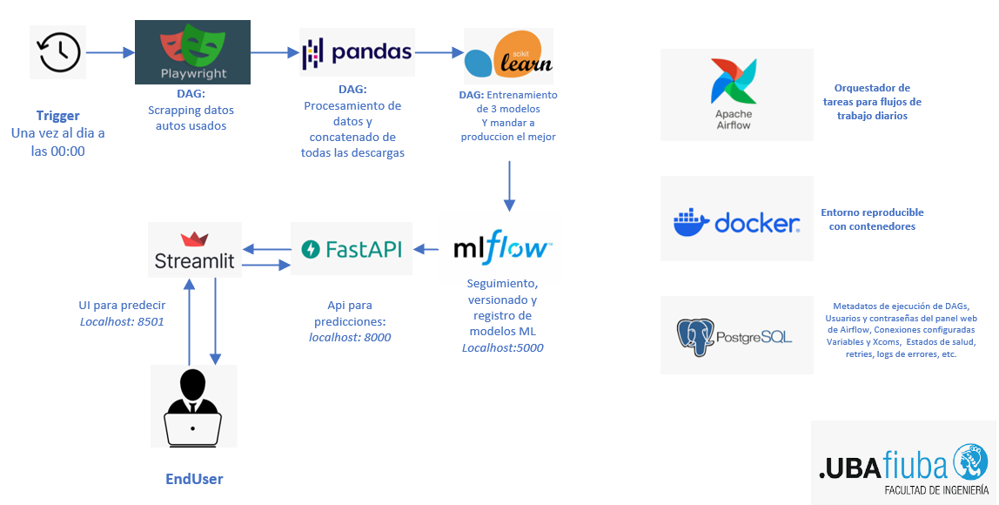

# 🚗 Predicción de Precios de Autos Usados con Playwright, Airflow y MLflow

Este proyecto implementa un flujo de trabajo completo de Machine Learning enfocado en la predicción del precio de autos usados en Bolivia. La solución automatiza desde el scrapping de datos hasta el despliegue del mejor modelo en producción utilizando Apache Airflow como orquestador y MLflow para el tracking y versionado de modelos.

## 🧠 Objetivo del Proyecto

1. **Scrapear** datos de autos usados desde una plataforma online.
2. **Limpiar** los datos descargados de forma incremental.
3. **Preprocesar** concatenar descargas anteriores, procesar variables categóricas, valores faltantes y construir los datasets `X_train`, `y_train`.
4. **Entrenar** tres modelos de regresión y promover el mejor a producción.
5. **Realizar predicciones** con el modelo en producción, desplegado en FastApi y Streamlit.

## 🧰 Tecnologías utilizadas

| Herramienta         | Descripción                                           |
|---------------------|-------------------------------------------------------|
| **Apache Airflow**  | Orquestador de tareas para flujos de trabajo diarios |
| **MLflow**          | Seguimiento, versionado y registro de modelos ML     |
| **Docker Compose**  | Entorno reproducible con contenedores                |
| **Pandas & Scikit-learn** | Procesamiento de datos y entrenamiento de modelos |
| **CatBoost / SVR / Random Forest**  | Modelos adicionales para comparación de desempeño    |
| **FastApi**           | Desplegado de la API de prediccion en produccion    |
| **Streamlit**  | UI para uso del servicio de prediccion on demand    |



## ⚙️ Estructura del Proyecto
- ├── airflow/
- │ ├── dags/
- │ │ └── scraping_autopia_dag.py
- │ │ └── entrenamiento_modelos_regresion_dag.py
- │ │ └── prediccion_modelo_produccion_dag.py
- │ ├──── utils/
- │ │ └── scraping_autopia.py
- │ ├──── data/
- │ ├─────── prediccion/
- │ ├─────── processed/
- │ ├─────── raw/
- │ ├── plugins/
- │ ├── config/
- │ └── secrets/
- ├── dockerfiles/
- │ └── airflow/ # Imagen extendida con dependencias
- ├── mlruns/ # Volumen persistente de MLflow
- ├── api/
- │   ├── main.py            # Código principal de FastAPI
- │   ├── model.py           # Lógica de carga del modelo y predicción
- │   ├── schemas.py         # Definición de inputs/outputs para la API
- │   └── Dockerfile         # Imagen personalizada para FastAPI
- ├── data/
- │ └── processed/ # Archivos .pkl listos para entrenamiento
- ├── streamlit/
- │ └── app.py
- │ └── Dockerfile
- │ └── requirements.txt
- ├── docker-compose.yaml
- ├── requirements.txt
- └── README.md

### 🔁 Flujo completo de DAGs

1. ### `scraping_autopia_dag` (Ejecutado manual o programado)
   - Ejecuta un script que scrapea datos desde [autopia.com.bo](https://autopia.com.bo).
   - Guarda los datos en formato `.csv` en la carpeta `data/raw/`.
   - Una vez finalizado, **activa automáticamente** el siguiente DAG.
   - _Observacion:_ Tarda + 110 minutos en descargar todos los registros de la pagina.

2. ### `entrenamiento_modelos_regresion_dag` (Ejecutado automáticamente tras scraping o de forma diaria)
   - **Carga del dataset** recién scrapeado.
   - **Preprocesamiento**:
     - Limpieza de columnas como `price`, `motor`, etc.
     - `TargetEncoder` para codificar variables categóricas (`marca`, `tipo`).
     - Map de variables binarias (`transmisión`).
   - **Entrenamiento de modelos**:
     - `RandomForestRegressor`
     - `CatBoostRegressor`
     - `SVR`
   - **Evaluación** con `MAE` y registro de métricas y modelos en **MLflow**.
   - **Promoción automática** del mejor modelo al stage `"Production"`.
   - **Archivado del modelo anterior** como `"Staging"` si existía.
   - Al finalizar, **dispara automáticamente** el DAG de predicción.

3. ### `prediccion_modelo_produccion_dag`
   - Carga el modelo en stage `"Production"` desde **MLflow**.
   - Prepara nuevas muestras o clientes para predicción.
   - Genera predicciones y las guarda en el directorio `data/predicciones/`.


### 🔁 Flujo completo de DAGs

1. ### `scraping_autopia_dag` (Ejecutado manual o programado)
   - Ejecuta un script que scrapea datos desde [autopia.com.bo](https://autopia.com.bo).
   - Guarda los datos en formato `.csv` en la carpeta `data/raw/`.
   - Una vez finalizado, **activa automáticamente** el siguiente DAG.
   - _Observacion:_ Tarda + 110 minutos en descargar todos los registros de la pagina.

2. ### `entrenamiento_modelos_regresion_dag` (Ejecutado automáticamente tras scraping o de forma diaria)
   - **Carga del dataset** recién scrapeado.
   - **Preprocesamiento**:
     - Limpieza de columnas como `price`, `motor`, etc.
     - `TargetEncoder` para codificar variables categóricas (`marca`, `tipo`).
     - Map de variables binarias (`transmisión`).
   - **Entrenamiento de modelos**:
     - `RandomForestRegressor`
     - `CatBoostRegressor`
     - `SVR`
   - **Evaluación** con `MAE` y registro de métricas y modelos en **MLflow**.
   - **Promoción automática** del mejor modelo al stage `"Production"`.
   - **Archivado del modelo anterior** como `"Staging"` si existía.
   - Al finalizar, **dispara automáticamente** el DAG de predicción.

3. ### `prediccion_modelo_produccion_dag`
   - Carga el modelo en stage `"Production"` desde **MLflow**.
   - Prepara nuevas muestras o clientes para predicción.
   - Genera predicciones y las guarda en el directorio `data/predicciones/`.

## 🔁 Ejecución

### 1. Clonar el repositorio
```bash
git clone https://github.com/FedericoArias1992/CEIA_TP_MLOps_1.git
```
# 2. Levantar el entorno completo
```bash
docker-compose up --build -d
```
Para detenerlo:
```Bash
docker compose down
```

Para detenerlo y eliminar todo:
```Bash
docker compose down --rmi all --volumes
```
Observacion: si al correr el DAG `entrenamiento_modelos_regresion_dag` es porque el entorno de MLFlow no tiene permisos para crear carpetas, en ese caso, hay que correr:
- mkdir -p mlruns
- sudo chown -R 50000:0 mlruns
No siempre sucede.

# 4. Acceder a interfaces
`Airflow UI`: http://localhost:8080
Para correr por primera vez, hay que activar el dag inicializador del workflow `scraping_autopia_dag` con eso se descargan los datos, preprocesan, entrenan y promueven a produccion el mejor modelo, una vez hecho esto, se pueden usar los servicios de FastApi y Streamlit.

`MLflow UI`: http://localhost:5000

`FastAPI`: http://localhost:8000 - A tomar en cuenta, ya que al inicializar el proyecto, no hay datos descargados -> no existe artefacto de prediccion. Entonces
                                 La API no retorna prediccion, pero si un log que retorna un status code 503 y una indicacion: `Modelo no disponible. Aún no ha sido entrenado o registrado en MLflow, por favor espera a completar el ciclo de descarga-entrenamiento.`

`Streamlit`: UI para prediccion: http://localhost:8501

```Bash
docker compose up
```
